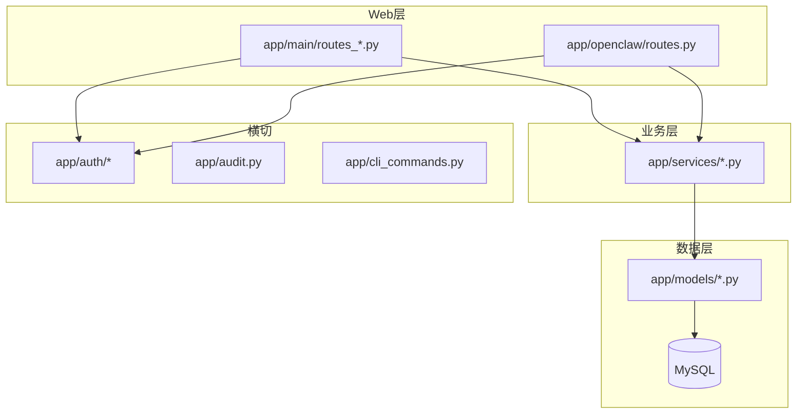
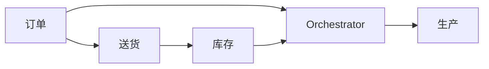

# 架构总览

## 分层

- **路由**（`app/main/`）：HTTP、Jinja 模板、表单与重定向；宜保持薄，复杂规则下沉 `services`。
- **服务**（`app/services/`）：业务规则、跨模型事务、与编排器/OpenClaw 的衔接。
- **模型**（`app/models/`）：SQLAlchemy 映射；**不在数据库层使用外键**，ORM 侧不用 `ForeignKey()`，用 `primaryjoin` + `foreign(子表.外键列)` 表达逻辑关联（见 `.cursor/rules/no-database-foreign-keys.mdc`）。

## 应用入口

- 启动：`run.py` → `create_app()`（[`app/__init__.py`](../../app/__init__.py)）
- 蓝图：`auth`（`/auth`）、`main`（主站 UI）、`openclaw`（`/api/openclaw`）
- 配置：[`app/config.py`](../../app/config.py)（`.env`、数据库、OpenClaw、Orchestrator 开关等）

## 权限与导航（RBAC）

- **菜单**（nav code）：控制页面入口；**能力**（capability code）：控制按钮/细粒度操作。
- 实现入口：`app/auth/menus.py`、`app/auth/capabilities.py`、`app/auth/decorators.py`（`menu_required` / `capability_required`）
- 数据：`app/models/rbac.py`（`sys_nav_item`、`sys_capability`、`role_allowed_*`）；缓存 `app/auth/rbac_cache.py`，角色/菜单保存后需 `invalidate_rbac_cache()`。
- 详情见 [项目 Skill：RBAC](../04_ai/project-skill/rbac_and_menus.md)。

## OpenClaw（对外 JSON API）

- 路由：`app/openclaw/routes.py`
- 鉴权：`app/auth/openclaw_auth.py`（全局 API Key 或用户 Token + 能力校验）
- 对话式接入规范：`docs/openclaw-skill/SKILL.md`

## 编排器（Orchestrator）

- 引擎：`app/services/orchestrator_engine.py`；契约与事件名：`app/services/orchestrator_contracts.py`
- 运维与事件流文档：[03_orchestrator/index.md](../03_orchestrator/index.md)

## 审计

- 全局 hook：`app/audit.py`；UI 点击上报：`app/main/routes_audit.py`

## 数据库迁移

- 新库：`scripts/sql/00_full_schema.sql`
- 旧库/持续升级：仅**新增** `scripts/sql/run_NN_*.sql`，**禁止修改已存在的 `run_*.sql`**
- 详见 [db-migrations.md](../01_development/db-migrations.md)

## 跨域协作（简图）

- 订单保存等可触发编排事件；送货发运可生成库存出库流水；生产测算会读库存与 BOM 等。各域细节见 `docs/02_domains/*.md`。
