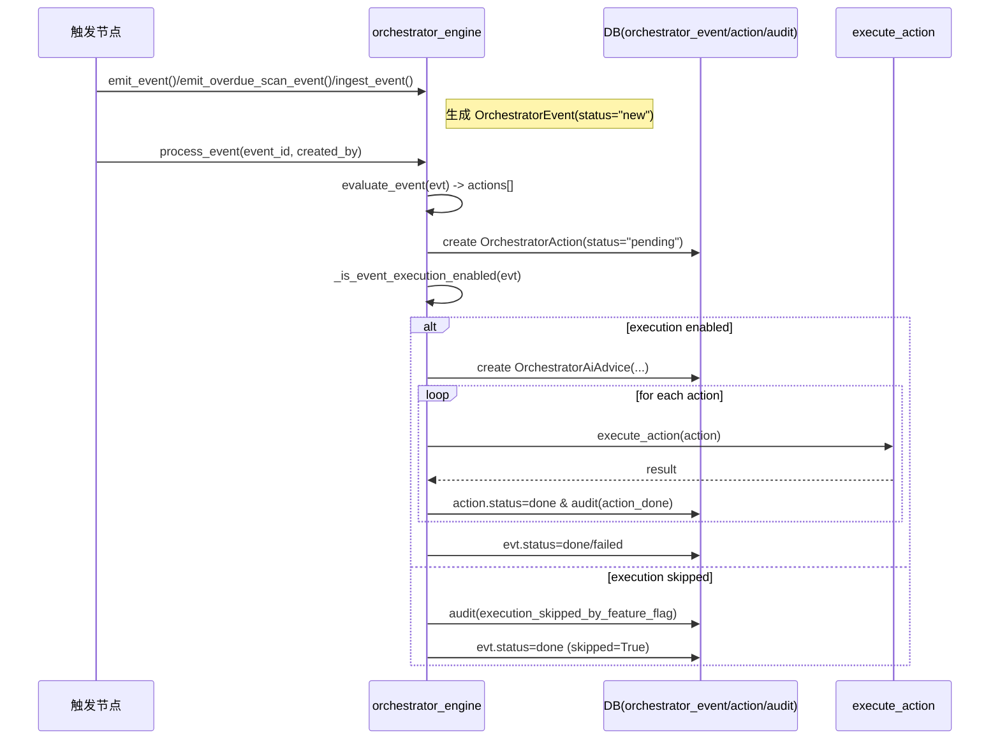

# Orchestrator 事件触发节点与后续流程（Event -> Action）

本文档整理了当前代码中 **所有事件触发入口节点**（endpoint/业务函数/CLI）以及 **触发后系统会做什么**，并给出统一的 **事件处理流程**与 **event_type -> action_type** 的映射关系。

## 0. 术语与对象

- **OrchestratorEvent（事件）**：记录 `event_type / biz_key / payload`，字段 `status` 初始为 `new`。
- **OrchestratorAction（动作）**：由引擎根据事件计算出来，字段 `status` 初始为 `pending`。
- **process_event(event_id)**：真正把某个事件跑起来的入口（会计算 actions 并执行）。
- **evaluate_event(event)**：事件评估逻辑（决定会生成哪些 action）。

核心代码：
- 事件入库：`app/services/orchestrator_engine.py` 的 `ingest_event()` / `emit_event()`
- 事件执行：`app/services/orchestrator_engine.py` 的 `process_event()`
- 事件评估：`app/services/orchestrator_engine.py` 的 `evaluate_event()`
- 动作执行：`app/services/orchestrator_engine.py` 的 `execute_action()`

## 1. 事件类型（event_type）与 payload 必填字段

事件类型定义在：`app/services/orchestrator_contracts.py`

| event_type | payload 必填字段 |
|---|---|
| `order.changed` | `order_id, source_id, version` |
| `inventory.changed` | `source_id, version` |
| `procurement.received` | `source_id, version` |
| `production.measured` | `preplan_id, source_id, version` |
| `production.reported` | `order_id, source_id, version` |
| `production.operation.reported` | `order_id, work_order_id, source_id, version` |
| `production.machine.abnormal` | `source_id, version, incident_id, severity` |
| `production.machine.recovered` | `source_id, version, incident_id` |
| `quality.inspection.started` | `order_id, source_id, version` |
| `quality.passed` | `order_id, source_id, version` |
| `quality.failed` | `order_id, source_id, version, qc_result` |
| `quality.reworked` | `order_id, source_id, version` |
| `order.overdue_scan` | `source_id, version` |
| `delivery.shipped` | `order_id, source_id, version` |

> 说明：`delivery.shipped` 在当前仓库中 **没有找到自动 emit 触发点**（仅作为支持类型存在于引擎的 evaluate 分支中）。你仍可通过通用入口手动入库事件。

## 2. 统一的事件处理流程（process_event / replay / retry）

### 2.1 `process_event(event_id)` 做什么

入口在：`app/services/orchestrator_engine.py`

执行步骤（顺序固定）：

1. 加载事件 `evt = OrchestratorEvent(id=event_id)`，不存在则报错。
2. 标记事件执行中：`evt.status = "processing"`，`evt.attempts += 1`
3. 计算动作列表：`actions = evaluate_event(evt)`
4. 检查执行开关与白名单：`_is_event_execution_enabled(evt)`
   - 若被禁用：记录审计 `execution_skipped_by_feature_flag`，将事件置为 `done` 并返回 `skipped=True`
   - 若允许：继续下一步
5. 生成 AI 建议（非必须但当前实现会做）：`_auto_generate_advice_for_event(evt, actions)`
   - 会写入 `OrchestratorAiAdvice` 与 `OrchestratorAiAdviceMetric`
6. 对每个 action 逐条执行：`execute_action(action, created_by=...)`
   - 成功：action 置 `done`，写入 `executed_at`，并记录审计 `action_done`
   - 异常：
     - `ValueError`：action 置 `dead`
     - 其它异常：action 置 `failed`，当 `retry_count >= 3` 时也置 `dead`
     - 失败会设置 `next_retry_at`（10/30/60 分钟策略）
     - 记录审计 `action_failed`
7. 最终事件状态：
   - 所有 action 都 `done` -> `evt.status="done"`
   - 否则 `evt.status="failed"`（并写 `evt.error_message="存在失败动作"`）

### 2.2 `retry_due_actions()` 做什么

入口在：`app/services/orchestrator_engine.py`，由：
- `POST /orchestrator/actions/retry`（`app/main/routes_orchestrator.py`）

行为：
- 仅在 `sys_feature_flag.orchestrator.retry_enabled` 打开时执行
- 扫描 `OrchestratorAction.status="failed"` 且 `next_retry_at <= now`
- 对每条 action 再执行一次 `execute_action`
- 成功则变 `done`；失败则按与 `process_event` 相同规则更新 `failed/dead/next_retry_at`

### 2.3 `replay_event_advanced()` 做什么

入口在：`app/services/orchestrator_engine.py`，由：
- `POST /orchestrator/events/<event_id>/replay`
- `POST /orchestrator/events/<event_id>/replay-conditional`
- `POST /orchestrator/events/<event_id>/replay-advanced`

行为要点：
- 仅在 `sys_feature_flag.orchestrator.replay_enabled` 打开时允许
- 会重新 `evaluate_event(evt)` 得到 actions，并支持：
  - `dry_run`：只生成 `OrchestratorReplayJob`，不真正执行
  - `selected_actions`：只允许重放指定 action_types
  - `allow_high_risk`：允许执行高风险 action（当前 high-risk actions 是 `CreatePreplan`、`RunProductionMeasure`）
  - 被阻断时会写 `OrchestratorReplayJob(status="blocked")` 并抛错
- 真正重放时：会调用 `ingest_event()` 生成一条“新事件记录”，再对新 event 调 `process_event()`

## 3. Event -> Action 映射（evaluate_event() 生成哪些动作）

核心逻辑：`app/services/orchestrator_engine.py:evaluate_event()`

动作类型定义在：`app/services/orchestrator_engine.py`
- `CreatePreplan`
- `RunProductionMeasure`
- `MoveOrderStatus`
- `CreateProcurementRequest`
- `ApplyAlternativeMaterial`
- `CreateOutsourceOrder`
- `SwitchSecondarySupplier`
- `EscalateDeviceAlert`
- `TriggerQualityRework`
- `TriggerQualityHold`

### 3.1 `order.changed`

执行前提：payload 有 `order_id>0`

行为：
- 先计算缺口：`_order_shortage_summary(order_id)`（对比库存汇总 vs 订单需求）
- 若有缺口（`has_shortage=True`）：
  - `CreatePreplan`
  - `CreateProcurementRequest`
  - 若规则允许：可能额外生成
    - `ApplyAlternativeMaterial`
    - `CreateOutsourceOrder`
    - `SwitchSecondarySupplier`
- 若无缺口：
  - `MoveOrderStatus` -> `target_status="pending"`

### 3.2 `inventory.changed` / `procurement.received`

行为：
- 计算缺口：`_order_shortage_summary(order_id)`
- 若缺口为无（`has_shortage=False`）：
  - `RunProductionMeasure`

### 3.3 `order.overdue_scan`

行为：
- 查询逾期订单：`SalesOrder.required_date < today` 且 `status in ("pending","partial")`
- 对每个逾期订单直接生成：
  - `CreateProcurementRequest`

> 注意：此分支 **不会**在 evaluate 阶段做库存缺口计算，因此 action payload 里通常也不会携带 `shortage.lines`。

### 3.4 生产/质检/机器相关

- `delivery.shipped`
  - `MoveOrderStatus` -> `target_status="delivered"`
- `production.measured`
  - 对预生产计划相关订单生成：`MoveOrderStatus` -> `target_status="partial"`
- `production.reported`
  - `MoveOrderStatus` -> `target_status="partial"`
- `production.operation.reported`
  - `MoveOrderStatus` -> `target_status="partial"`
- `quality.inspection.started`
  - `MoveOrderStatus` -> `target_status="pending"`
- `quality.passed`
  - `MoveOrderStatus` -> `target_status="partial"`
- `quality.failed`
  - `TriggerQualityHold`（payload 里携带 `target_status="pending"`）
  - `TriggerQualityRework`
- `quality.reworked`
  - `MoveOrderStatus` -> `target_status="partial"`
- `production.machine.abnormal` / `production.machine.recovered`
  - `EscalateDeviceAlert`（payload 携带 incident_id/severity/status=事件类型）

## 4. Action 执行（execute_action() 会做什么）

动作执行入口：`app/services/orchestrator_engine.py:execute_action()`

当前实现要点（重要）：
- 很多 action 的执行函数目前主要是“占位/返回结果”，并不会真正创建采购单/外协单等业务数据；
- 只有部分 action（如 `CreatePreplan` / `RunProductionMeasure` / `MoveOrderStatus`）会直接写业务表或调用业务服务。

各 action 当前执行行为：

1. `CreatePreplan`
   - 创建 `ProductionPreplan(status="draft")`
   - 根据 action.payload.shortage.lines 写 `ProductionPreplanLine`
   - 若没有有效缺口行：抛 `ValueError`（会导致 action 进入 `dead`）

2. `RunProductionMeasure`
   - 查找可执行的 `ProductionPreplan(status in ("draft","planned"))`
   - 调用 `production_svc.measure_production_for_preplan(...)`

3. `MoveOrderStatus`
   - 加载 `SalesOrder(order_id)`
   - 校验硬约束：`validate_hard_constraints(...)`
   - 设置 `order.status = action.payload.target_status`

4. `CreateProcurementRequest`
   - 当前实现：只读取 `payload.shortage.lines` 并返回
     - `{"suggested_procurement_lines": len(shortage_lines)}`
   - 若本事件未提供 `shortage.lines`（例如 `order.overdue_scan` 的 action），则计数会为 0

5. `ApplyAlternativeMaterial` / `CreateOutsourceOrder` / `SwitchSecondarySupplier`
   - 当前实现同样偏占位：只返回候选数量与 `strategy="rule_template"`

6. `EscalateDeviceAlert`
   - 当前实现返回 `{"incident_id":..., "severity":..., "escalated": True}`

7. `TriggerQualityHold` / `TriggerQualityRework`
   - 当前实现两者共用 `_execute_quality_rework()`
   - 返回 `{"rework_created": True, "order_id": ...}`

## 5. 事件触发节点清单（哪些地方会生成/入库 OrchestratorEvent）

本节列出当前仓库中所有通过 `ingest_event()` / `emit_event()` / `emit_overdue_scan_event()` 产生事件的入口。

### 5.1 通用 Orchestrator API（可手动入库/执行）

1. `POST /orchestrator/events/ingest`
   - 文件：`app/main/routes_orchestrator.py`
   - 行为：调用 `orchestrator_engine.ingest_event()`
   - 结果：
     - 创建 `OrchestratorEvent(status="new")`
     - **不会自动调用** `process_event`
   - 你需要再调用：
     - `POST /orchestrator/events/<event_id>/run` 来执行

2. `POST /orchestrator/events/<event_id>/run`
   - 文件：`app/main/routes_orchestrator.py`
   - 行为：调用 `orchestrator_engine.process_event(event_id, created_by=...)`

3. `POST /orchestrator/actions/retry`
   - 文件：`app/main/routes_orchestrator.py`
   - 行为：调用 `orchestrator_engine.retry_due_actions(...)`

4. `POST /orchestrator/events/<event_id>/replay*`
   - 文件：`app/main/routes_orchestrator.py`
   - 行为：调用 `orchestrator_engine.replay_event*`

5. `POST /orchestrator/actions/<action_id>/recover`、`/recover-batch`
   - 文件：`app/main/routes_orchestrator.py`
   - 行为：恢复 dead 的 action 为 `pending` 并允许后续重试

### 5.2 Orchestrator 业务手动触发端点（会立即 process_event）

这些 endpoint 会调用 `emit_event()` / `emit_overdue_scan_event()`，随后立刻执行 `process_event()`：

1. `POST /orchestrator/orders/<order_id>/production-reported`
   - 触发事件：`production.reported`
2. `POST /orchestrator/orders/<order_id>/operation-reported`
   - 触发事件：`production.operation.reported`
3. `POST /orchestrator/orders/<order_id>/quality-started`
   - 触发事件：`quality.inspection.started`
4. `POST /orchestrator/orders/<order_id>/quality-passed`
   - 触发事件：`quality.passed`
5. `POST /orchestrator/orders/<order_id>/quality-failed`
   - 触发事件：`quality.failed`（payload `qc_result` 来自 body，默认 `failed`）
6. `POST /orchestrator/orders/<order_id>/quality-reworked`
   - 触发事件：`quality.reworked`
7. `POST /orchestrator/machines/incidents/<incident_id>/abnormal`
   - 触发事件：`production.machine.abnormal`
8. `POST /orchestrator/machines/incidents/<incident_id>/recovered`
   - 触发事件：`production.machine.recovered`
9. `POST /orchestrator/scan/overdue`
   - 触发事件：`order.overdue_scan`

来源：`app/main/routes_orchestrator.py`

### 5.3 CLI 触发（会立即 process_event）

1. `flask orchestrator-scan-overdue --created-by <user_id>`
   - 文件：`app/cli_commands.py`
   - 行为：
     - `emit_overdue_scan_event(...)`
     - `process_event(evt.id, created_by=...)`

### 5.4 业务服务自动 emit（入库事件，但不一定立即执行）

下列代码会调用 `emit_event()` 把事件写入 `orchestrator_event`，但在本仓库内 **没有找到自动调用 `process_event()` 的位置**（即：事件往往停留在 `status="new"`，需要后续手动/外部 worker 触发 `/orchestrator/events/<id>/run` 或其它执行机制）。

1. 订单创建
   - 文件：`app/services/order_svc.py`
   - 场景：`create_order_from_data(...)` 创建订单成功后
   - 触发事件：`order.changed`

2. 库存变化
   - 文件：`app/services/inventory_svc.py`
   - 场景：
     - `create_delivery_outbound_movements(...)`（送货出库生成库存流水）
     - `create_manual_movement(...)`（手工/补录库存流水）
   - 触发事件：`inventory.changed`
   - 说明：送货出库会对 related order_ids 逐单发事件。

3. 采购收货（posted）
   - 文件：`app/main/routes_procurement.py`
   - 场景：收货单保存时发生“从非 posted 到 posted”（posting_now）
   - 触发事件：`procurement.received`

4. 生产测算/报工/质检/事故
   - 文件：`app/main/routes_production.py`
   - 场景与触发事件：
     - `/production/preplans/<preplan_id>/measure`
       - 触发事件：`production.measured`
     - `/production/work-orders/<work_order_id>/report`
       - 触发事件：`production.operation.reported` + `production.reported`
       - 注意：这里会对 `production.reported` 调用 `process_event`（所以该链路会立即落 action）
     - `/production/work-orders/<work_order_id>/quality-pass`
       - 触发事件：`quality.inspection.started` + `quality.passed`
       - 注意：这里会对 `quality.passed` 调用 `process_event`
     - `/production/incidents/new`
       - 触发事件：`production.machine.abnormal`
     - `/production/incidents/<incident_id>/edit`
       - 若改为 `closed`：触发 `production.machine.recovered`
       - 若在 `open / in_progress`：触发 `production.machine.abnormal`

## 6. 示例流程（把“一个事件触发”串起来）

### 6.1 例：手动触发逾期扫描 `/orchestrator/scan/overdue`

1. 请求进入 `app/main/routes_orchestrator.py`
2. 调用 `emit_overdue_scan_event()`，写入 `OrchestratorEvent(event_type="order.overdue_scan", status="new")`
3. 立刻调用 `process_event(evt.id)`
4. `evaluate_event()` 查询逾期订单并为每单生成 `CreateProcurementRequest` actions
5. 执行 action：`_execute_create_procurement_request()`
   - 当前仅返回建议行数（无 shortage.lines 则为 0），并通过 action.status 更新审计与状态

### 6.2 例：订单缺料（`order.changed`）

1. 订单被创建触发 `order.changed`（入库）
2. 调用 `/orchestrator/events/<event_id>/run`（或其它执行方式）触发 `process_event`
3. `evaluate_event()` 会计算库存缺口 `_order_shortage_summary(order_id)`
4. 若缺口存在：
   - 创建 `CreatePreplan` + `CreateProcurementRequest`（以及可选替代/外协/二供切换）
5. `CreatePreplan` 会真正创建 `ProductionPreplan`/`ProductionPreplanLine`

## 7. Mermeid 顺序图（可视化）

## 8. 需要你确认的点（当前实现差异）

如果你的业务预期是“逾期扫描后直接完成采购请求创建（写入采购表）”，那么需要注意：

- 引擎确实会生成 `CreateProcurementRequest` actions（见 `evaluate_event` 的 `order.overdue_scan` 分支）
- 但当前 `execute_action()` 中 `CreateProcurementRequest` 的实现是“返回 suggested_procurement_lines”，并不直接落采购单数据
- 因此逾期扫描链路目前更接近“建议/占位 action 生成”，而不是完整闭环自动建单

